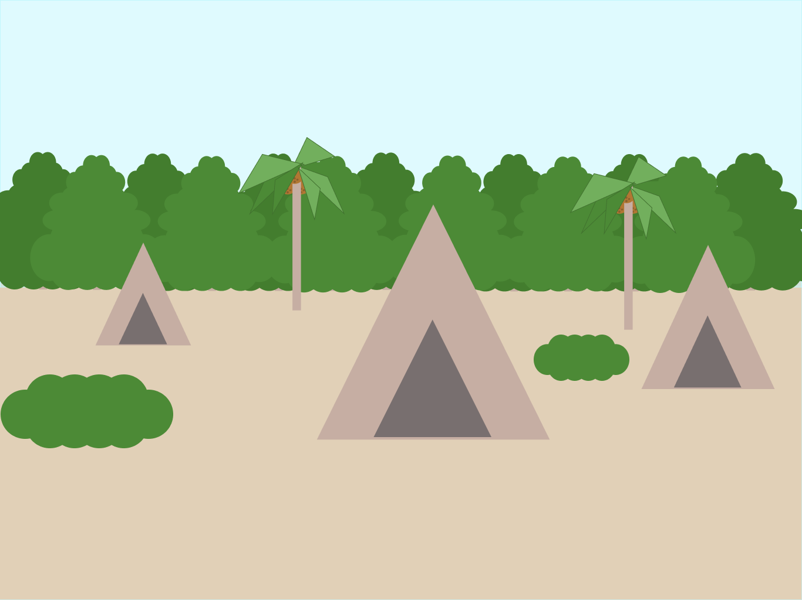

# Swift Student Challenge 2023 - Clara and the Heroines of Tejucupapo
## 📱 App

- The app is an interactive storytelling experience that aims to bring visibility to the little-known story of Clara Camarão, a Potiguar indigenous woman who played an important role in leading a women's indigenous troop in battles against invaders of their territories during the colonial period in Brazil.
- Through the use of SwiftUI, SpriteKit, and AVFoundation, the app allows users to engage with the story and learn more about Clara Camarão's life and contributions to Brazilian history.
- By highlighting Clara Camarão's bravery and the strength of her companions, the app seeks to celebrate and honor the memory of these indigenous women and raise awareness about their cultural and historical significance.

## 🎬 Video

## 🎨 Design
### Resources

- I used Figma to create a brainstorm and workflow for my app. It was really helpful to visualize the different screens and transitions. Additionally, I also used Figma to design and draw all the assets in the story, including backgrounds, characters and objects. It was great to have everything in one place and be able to make changes quickly and easily. Overall, Figma was a crucial tool in the design and development of my interactive experience;
- During the design process, I followed various references to help me make the project, especially to get suggestions for fonts, colors, and other design elements;
- I used an iPad device to test my app with different users. This allowed me to have a better understanding of how the app was being received and used by real people, and to gather valuable feedback on the user experience and interface. Testing on a physical device like the iPad also helped me to ensure that the app was optimized for touch-based interaction, as well as to check for any bugs or technical issues that might have arisen during development.

### References

https://plenarinho.leg.br/index.php/2021/04/primeira-heroina-indigena-brasil/

### Wireframe/Prototypes

As I mentioned before, I relied a lot on figma to create the workflow for my project. It was useful to map out the scenes and organize the structure of the story.

I began by creating a frame for each scene I imagined, starting with the first scene and progressing through the narrative. As I worked on each frame, I added more details to flesh out the story and gameplay mechanics. This included things like character designs, dialogue, and interactive elements.

One of the benefits of using Figma for this process is that it allowed me to easily review my ideas and make changes as needed. I could move frames around, adjust the elements, and refine the details until I was satisfied with the overall structure of the game.

[Figma Project](https://www.figma.com/file/ADG8dPuK9XtCdTYbQ1toAv/Swift-Student-Challenge?type=design)

### UI/UX

- I made the decision to create my own assets. I knew that this would be the best way to maintain consistency in my project and create a unique look that represented the Brazilian northeast and Potiguar culture in an authentic way. While creating my own assets was time-consuming, it was ultimately worth it;
- Storytelling played a critical role in my project as it was based on a real character, Clara Camarão, and her role in leading the Heroines of Tejucupapo in battles against invaders of their territories. As a result, it was essential for me to create a meaningful experience that would demonstrate the historical and cultural significance of these events, especially for the local population of Tejucupapo;
- Throughout the development of my project, I frequently sought feedback and advice from my colleagues and mentors. This helped me to gain a better understanding of external opinions on various aspects of my project and allowed me to approach them in a more effective way;
- I also let them test my app a lot to provide me feedback on their experience while playing the game. This feedback was incredibly valuable in helping me to refine the gameplay, identify any bugs or issues, and improve the overall user experience.

### Design System

- I created a design system to ensure consistency in the visual elements of my app. By making all the assets myself, I was able to reuse them to create variations for the same asset, maintaining a coherent visual style. This approach helped me create a visually appealing and unified experience for my experience;
- I chose to use the Poppins font for most of the text and buttons in my app because it is easy to read and has a clean, modern look that I felt was appropriate for the project. For the game title in the main menu, I used Lobster font, which has a unique and playful style that complemented the overall visuals of the app.

### App Icon

- Selecting an icon for my app was a straightforward process, as I simply used the same image from the main menu.

### Assets

All assets present in the app were created by me and are drawing inspirations from Brazilian northeast and Potiguar culture. A few assets from my app:

### Challenges

- I was able to design and implement my app relatively quickly, but I had some insecurities about the storytelling and the overall engagement of the app. To address these concerns, I sought feedback from colleagues and mentors to improve the user experience and make it more emotionally impactful. Ultimately, I am proud of what I achieved in creating an app that represents the story of Clara and the Heroines of Tejucupapo.

## 👩🏻‍💻 Coding

### Resources

- I coded my experience using Xcode. Its interface is much more intuitive and complete than the one specific for Swift Playgrounds. I made sure the project was swiftpm file though, since it should be run in the Playgrounds after all;
- To develop my interactive experience, I used SwiftUI, SpriteKit and AVFoundation. SwiftUI was useful to organize the architecture of the app with the game manager and create the transitions between scenes. AVFoundation was important to implement the background music for my app. In addition, I chose the SpriteKit framework because of the wide variety of interesting features it offers to create dynamic scenes with animations.
- My colleagues helped me with suggestions on how to implement some elements from my app, such as adding music background to the scenes and fixing some bugs.

###  Technologies

- SwiftUI;
- SpriteKit;
- AVFoundation

### Challenges

- As I was testing my app, I encountered some bugs that didn't occur in the simulator, especially related to the resolution and the app restarting when flipping the device, which I had to fix. To ensure a good user experience, I made sure to make the app responsive and compatible with different screen sizes of iPad.
